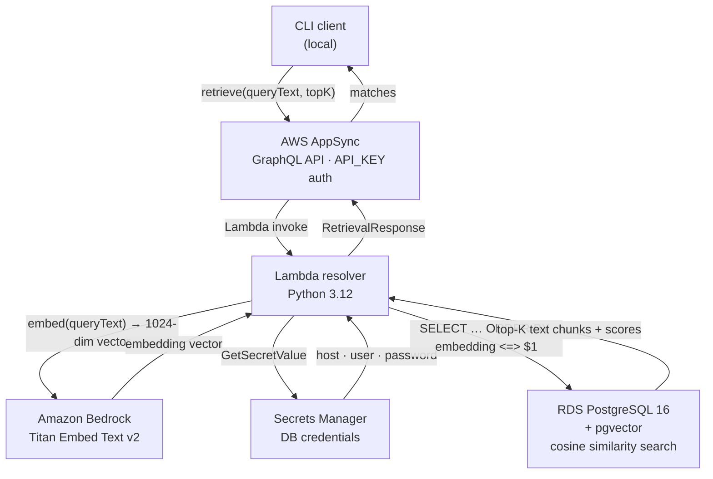

# Architecture

## Overview

This POC implements semantic retrieval over GraphQL. A client submits a plain-English question; the system returns ranked text passages from a document store without exposing any vector math externally.

---

## Request Flow



ASCII fallback:

```
┌─────────────┐        GraphQL query         ┌──────────────────┐
│  CLI client │ ─────────────────────────────▶│  AWS AppSync     │
│ (local)     │  x-api-key header             │  (GraphQL API)   │
└─────────────┘                               └────────┬─────────┘
                                                       │ Lambda invoke
                                                       ▼
                                              ┌──────────────────┐
                                              │  Lambda resolver │
                                              │  (Python 3.12)   │
                                              └──┬───────────┬───┘
                                                 │           │
                              Bedrock invoke      │           │  GetSecretValue
                                                 ▼           ▼
                                        ┌─────────────┐  ┌──────────────────┐
                                        │   Bedrock   │  │ Secrets Manager  │
                                        │ Titan Embed │  │  (DB password)   │
                                        │    v2       │  └────────┬─────────┘
                                        └──────┬──────┘           │
                                               │ 1024-dim          │ credentials
                                               │ embedding         │
                                               ▼                   ▼
                                        ┌──────────────────────────────┐
                                        │   RDS PostgreSQL 16.6        │
                                        │   + pgvector extension       │
                                        │                              │
                                        │  cosine similarity search    │
                                        │  returns top-K text chunks   │
                                        └──────────────────────────────┘
```

---

## Components

### AWS AppSync
- GraphQL API with `API_KEY` authentication
- Single query: `retrieve(queryText: String!, topK: Int): RetrievalResponse!`
- Routes all requests to the Lambda data source via a VTL resolver
- Hides the Lambda invocation details from the client entirely

### Lambda Resolver (`handler.py`)
Single function that owns the full retrieval pipeline:

1. Receives `{ arguments: { queryText, topK } }` from AppSync
2. Fetches DB credentials from Secrets Manager
3. Calls Bedrock to embed the query text
4. Runs a cosine similarity query against pgvector
5. Returns ranked matches as structured JSON

### Amazon Bedrock — Titan Embed Text v2
- Model: `amazon.titan-embed-text-v2:0`
- Input: plain-text string
- Output: 1024-dimensional normalized float vector
- Called once per query; no caching in this version

### RDS PostgreSQL + pgvector
- Engine: PostgreSQL 16.6 on `db.t4g.micro`
- Extension: `vector` (pgvector)
- Table: `document_chunks` with a `vector(1024)` column
- Search operator: `<=>` (cosine distance)
- Sequential scan used (IVFFlat index requires ~100+ rows to be effective)

**Schema:**
```sql
CREATE TABLE document_chunks (
    chunk_id      TEXT PRIMARY KEY,
    document_id   TEXT NOT NULL,
    text          TEXT NOT NULL,
    source        TEXT,
    embedding     vector(1024)
);
```

**Query pattern:**
```sql
SELECT chunk_id, document_id, text, source,
       1 - (embedding <=> CAST($1 AS vector)) AS similarity_score
FROM document_chunks
ORDER BY embedding <=> CAST($1 AS vector)
LIMIT $2;
```

### Secrets Manager
- Stores DB host, port, name, username, and password as a JSON secret
- Lambda fetches it at runtime; no credentials in code or environment variables

---

## Networking

```
VPC (10.0.0.0/16)
├── private-subnet-a (10.0.1.0/24, us-east-1a)
│   ├── Lambda ENI
│   └── RDS primary
├── private-subnet-b (10.0.2.0/24, us-east-1b)
│   └── RDS standby subnet (required by subnet group)
├── VPC Interface Endpoint → secretsmanager
├── VPC Interface Endpoint → bedrock-runtime
└── Internet Gateway (required for RDS public endpoint)
```

**Why VPC endpoints instead of NAT Gateway:**
Lambda needs to reach Bedrock and Secrets Manager. VPC interface endpoints (~$14/mo for two) are cheaper than a NAT Gateway (~$32/mo) and keep traffic off the public internet.

**Why RDS is publicly accessible:**
The seed script runs locally and connects directly to RDS. Making RDS publicly accessible avoids the need for a bastion host or a separate seed Lambda. The random 24-character password is the access control. Destroy with `make tf-destroy` when done.

---

## Seed Flow

```
local machine
  → reads documents.json
  → calls Bedrock to embed each chunk
  → connects to RDS public endpoint
  → INSERT INTO document_chunks (upsert on chunk_id)
```

This runs outside AWS (no Lambda involved) using the local AWS credentials.

---

## GraphQL Contract

```graphql
type Query {
  retrieve(queryText: String!, topK: Int = 5): RetrievalResponse!
}

type RetrievalResponse {
  queryText: String!
  matches: [RetrievalMatch!]!
}

type RetrievalMatch {
  documentId: String!
  chunkId:    String!
  text:       String!
  similarityScore: Float!
  source:     String
}
```

The client never sends or receives a vector. Embedding is an internal implementation detail.

---

## Cost Estimate (us-east-1, while running)

| Resource | ~$/month |
|---|---|
| RDS db.t4g.micro (20 GB gp2) | ~$13 |
| VPC endpoint × 2 | ~$14 |
| Lambda + Bedrock invocations | ~$0 at POC scale |
| **Total** | **~$27/month** |

Run `make tf-destroy` to stop all charges.

---

## Design Decisions

| Decision | Rationale |
|---|---|
| Single Lambda resolver | Simplest path; pipeline resolver is a later option |
| pgvector over a managed vector DB | Reuses existing RDS skill; cheap; destroyable |
| API_KEY auth on AppSync | Sufficient for a POC; swap to Cognito for production |
| Sequential scan (no IVFFlat) | IVFFlat requires ~100+ rows; seqscan is fine at POC scale |
| pg8000 (pure Python) | No compiled binaries needed in the Lambda layer |
| No NAT Gateway | VPC endpoints are cheaper and sufficient |
