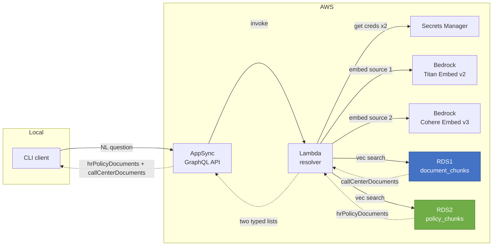

# Architecture

## Overview

This POC implements semantic retrieval over GraphQL across two independent data sources. A client submits a plain-English question; the system fans out to both backends and returns results in two separate typed lists — HR policy documents and call-center documents — each ranked by cosine similarity within their own source. No vector math is exposed externally.

Each data source uses a different embedding model and a slightly different database schema, demonstrating that the retrieval layer can federate over heterogeneous vector stores behind a single unified API.

---

## Request Flow



---

## Components

### AWS AppSync
- GraphQL API with `API_KEY` authentication
- Single query: `retrieveMatchingDocuments(queryText: String!, topK: Int, nextToken: String): RetrievalResponse!`
- Routes all requests to the Lambda data source via a VTL resolver
- The client is unaware of how many backends are queried or which embedding model is used

### Lambda Resolver

The resolver is split into four modules, each with a single responsibility:

```
app/lambda/
├── handler.py       — AppSync entry point, parses event
├── retrieval.py     — fans out to both sources, returns two typed lists
├── bedrock_embed.py — embed_titan() and embed_cohere() functions
└── db.py            — search_source1() and search_source2() functions
```

#### `handler.py` — entry point

AppSync invokes this with a payload shaped by the VTL request template:

```python
def handler(event, context):
    args = event.get("arguments", {})
    query_text = args.get("queryText", "")
    top_k = args.get("topK", 5)
    hr_docs, cc_docs = retrieve_matches_split(query_text=query_text, top_k=top_k)
    return {
        "queryText": query_text,
        "hrPolicyDocuments": hr_docs,
        "callCenterDocuments": cc_docs,
        "totalResults": len(hr_docs) + len(cc_docs),
        "hasMore": False,
        "nextToken": None,
    }
```

#### `retrieval.py` — fan-out orchestrator

Embeds the query with both models and queries both databases, returning two separate lists:

```python
def retrieve_matches_split(query_text: str, top_k: int = 5):
    if not query_text:
        return [], []
    emb1 = embed_titan(query_text)
    emb2 = embed_cohere(query_text)
    cc_docs = search_source1(emb1, top_k)
    hr_docs = search_source2(emb2, top_k)
    return hr_docs, cc_docs
```

Each source returns its own top-K results, ranked by cosine similarity within that source. Results are not merged or re-ranked across sources — the typed lists in the response make the source of each result explicit.

#### `bedrock_embed.py` — two embedding functions

**Titan Embed v2** (source 1):
```python
def embed_titan(query_text: str) -> list[float]:
    body = json.dumps({"inputText": query_text, "dimensions": 1024, "normalize": True})
    resp = _bedrock_titan().invoke_model(modelId=model_id, body=body, ...)
    return json.loads(resp["body"].read())["embedding"]
```

**Cohere Embed English v3** (source 2):
```python
def embed_cohere(query_text: str) -> list[float]:
    body = json.dumps({"texts": [query_text], "input_type": "search_query"})
    resp = _bedrock_cohere().invoke_model(modelId=model_id, body=body, ...)
    return json.loads(resp["body"].read())["embeddings"][0]
```

Key API differences between the two models:

| | Titan Embed v2 | Cohere Embed English v3 |
|---|---|---|
| Request key | `inputText` | `texts` (array) |
| Normalization param | `"normalize": true` | not needed (always normalized) |
| `input_type` | not used | `"search_query"` (at query time) |
| Response key | `embedding` | `embeddings[0]` |
| Dimensions | 1024 | 1024 |

Both clients are module-level singletons reused across warm Lambda invocations. Since both call the same `bedrock-runtime` regional endpoint, they could share a single boto3 client — they are kept separate here for readability.

#### `db.py` — two search functions

Both functions follow the same pattern (connect via Secrets Manager, cosine search, close), but target different RDS instances and different tables:

```python
def search_source1(embedding, top_k=5):
    conn = _connect(os.environ["SECRET_ARN"])        # RDS1
    rows = conn.run("""
        SELECT chunk_id, document_id, text, source,
               1 - (embedding <=> CAST(:vec AS vector)) AS similarity_score
        FROM document_chunks ORDER BY ... LIMIT :k
    """, ...)
    return [{"chunkId": r[0], ..., "metadata": None} for r in rows]

def search_source2(embedding, top_k=5):
    conn = _connect(os.environ["SECRET_ARN_2"])      # RDS2
    rows = conn.run("""
        SELECT chunk_id, policy_id, text, source, category,
               1 - (embedding <=> CAST(:vec AS vector)) AS similarity_score
        FROM policy_chunks ORDER BY ... LIMIT :k
    """, ...)
    return [{"chunkId": r[0], ..., "metadata": {"category": r[4]} if r[4] else None} for r in rows]
```

Notes:
- `<=>` is pgvector's cosine distance operator (lower = more similar)
- `1 - distance` converts to similarity score (higher = better match)
- `CAST(:vec AS vector)` avoids a pg8000 named-parameter parsing conflict with `::vector`
- `pg8000.native` is pure Python — no compiled binary needed in the Lambda layer
- `search_source2` fetches the `category` column and surfaces it through `metadata.category`

---

### Amazon Bedrock — Two Embedding Models

| | Source 1 | Source 2 |
|---|---|---|
| Model | `amazon.titan-embed-text-v2:0` | `cohere.embed-english-v3` |
| Dimensions | 1024 | 1024 |
| Normalization | Unit-normalized (explicit `normalize: true`) | Unit-normalized by default |
| Seeding `input_type` | N/A | `"search_document"` |
| Query `input_type` | N/A | `"search_query"` |

Both produce 1024-dimensional unit-normalized vectors, making cosine similarity scores approximately comparable in the `[0, 1]` range within each source.

---

### RDS PostgreSQL + pgvector — Two Instances

#### Source 1 — Call-center documents

- Instance: `fm-appsync-embedding-retrieval-poc-db`
- Database: `embeddingdb`
- Table: `document_chunks`

```sql
CREATE TABLE document_chunks (
    chunk_id      TEXT PRIMARY KEY,
    document_id   TEXT NOT NULL,
    text          TEXT NOT NULL,
    source        TEXT,
    embedding     vector(1024)    -- Titan Embed v2
);
```

#### Source 2 — HR policies

- Instance: `fm-appsync-embedding-retrieval-poc-hr-db`
- Database: `hrpolicydb`
- Table: `policy_chunks`

```sql
CREATE TABLE policy_chunks (
    chunk_id    TEXT PRIMARY KEY,
    policy_id   TEXT NOT NULL,     -- domain-appropriate name vs. document_id
    text        TEXT NOT NULL,
    category    TEXT,              -- e.g. "onboarding", "leave", "performance"
    source      TEXT,
    embedding   vector(1024)       -- Cohere Embed English v3
);
```

The schemas are intentionally slightly different: `policy_id` instead of `document_id`, and an additional `category` column that captures policy classification. `category` is now surfaced through the GraphQL API via `HRPolicyDocument.metadata.category`. The Lambda maps `policy_id` to the `documentId` response field for both sources.

**Search query pattern (identical for both tables):**
```sql
SELECT chunk_id, <id_col>, text, source, [category,]
       1 - (embedding <=> CAST(:vec AS vector)) AS similarity_score
FROM <table>
ORDER BY embedding <=> CAST(:vec AS vector)
LIMIT :k;
```

Sequential scan is used at POC scale. IVFFlat indexing requires ~100+ rows to be effective.

---

### Secrets Manager

Two secrets, one per RDS instance. Both store the same JSON shape:
```json
{ "username": "...", "password": "...", "host": "...", "port": 5432, "dbname": "..." }
```

Lambda has `secretsmanager:GetSecretValue` permission on both ARNs. Credentials are fetched at call time; none appear in code or environment variables.

---

## Networking

```
VPC (10.0.0.0/16)
├── private-subnet-a (10.0.1.0/24, us-east-1a)
│   ├── Lambda ENI
│   ├── RDS1 primary
│   └── RDS2 primary
├── private-subnet-b (10.0.2.0/24, us-east-1b)
│   ├── RDS1 standby subnet
│   └── RDS2 standby subnet
├── VPC Interface Endpoint → secretsmanager
├── VPC Interface Endpoint → bedrock-runtime   (serves both Titan and Cohere)
└── Internet Gateway (required for RDS public endpoints)
```

Both RDS instances share the same subnet group and the same RDS security group. The single `bedrock-runtime` VPC endpoint serves both embedding models — Bedrock endpoints are regional, not model-specific.

---

## Seed Flow

```
local machine
  → reads documents.json  → calls Bedrock Titan v2 to embed each chunk
    → connects to RDS1 public endpoint
    → INSERT INTO document_chunks (upsert on chunk_id)

  → reads hr_policies.json → calls Bedrock Cohere v3 to embed each chunk
    → connects to RDS2 public endpoint
    → INSERT INTO policy_chunks (upsert on chunk_id)
```

Both sources are seeded in a single `make seed` run. Cohere seeding uses `input_type: "search_document"` (as opposed to `"search_query"` used at retrieval time) — this distinction is part of Cohere's asymmetric embedding design.

---

## GraphQL Contract

```graphql
type Query {
  retrieveMatchingDocuments(queryText: String!, topK: Int = 5, nextToken: String): RetrievalResponse!
}

type RetrievalResponse {
  queryText: String!
  hrPolicyDocuments: [HRPolicyDocument!]!
  callCenterDocuments: [CallCenterDocument!]!
  totalResults: Int
  hasMore: Boolean
  nextToken: String
}

type HRPolicyDocument {
  documentId: String!
  chunkId: String!
  text: String!
  similarityScore: Float!
  source: String
  metadata: DocumentMetadata
}

type CallCenterDocument {
  documentId: String!
  chunkId: String!
  text: String!
  similarityScore: Float!
  source: String
  metadata: DocumentMetadata
}

type DocumentMetadata {
  title: String
  category: String
  createdAt: String
  updatedAt: String
}
```

The client never sends or receives a vector. The two typed lists make the source of each result explicit without requiring a `dataSource` tag on individual items.

---

## Cost Estimate (us-east-1, while running)

| Resource | ~$/month |
|---|---|
| RDS db.t4g.micro × 2 (20 GB gp2 each) | ~$26 |
| VPC endpoint × 2 | ~$14 |
| Lambda + Bedrock invocations | ~$0 at POC scale |
| **Total** | **~$40/month** |

Run `make tf-destroy` to stop all charges.

---

## Design Decisions

| Decision | Rationale |
|---|---|
| Two separate RDS instances | Maximum isolation between data sources; each can be sized, versioned, or destroyed independently |
| Different embedding models per source | Demonstrates multi-model federation; Cohere has different tokenization and training data than Titan |
| Typed result lists (hrPolicyDocuments / callCenterDocuments) | Makes the two-source demo story immediately visible; each source is ranked independently, removing the need for cross-model score calibration |
| DocumentMetadata in schema | Surfaces `category` from `policy_chunks` through the API; call-center docs return null metadata, demonstrating the schemas differ |
| `nextToken` in query input | Pagination infrastructure stub; `hasMore` is always false at POC scale but the shape is production-ready |
| Same subnet group for both RDS | Subnet groups are a logical grouping of subnets, not bound to a single instance; reusing avoids redundant infrastructure |
| Single Lambda resolver | Simplest path; pipeline resolver is a later option |
| pgvector over a managed vector DB | Reuses existing RDS skill; cheap; destroyable |
| API_KEY auth on AppSync | Sufficient for a POC; swap to Cognito for production |
| Sequential scan (no IVFFlat) | IVFFlat requires ~100+ rows; seqscan is fine at POC scale |
| pg8000 (pure Python) | No compiled binaries needed in the Lambda layer |
| No NAT Gateway | VPC endpoints are cheaper and sufficient |
