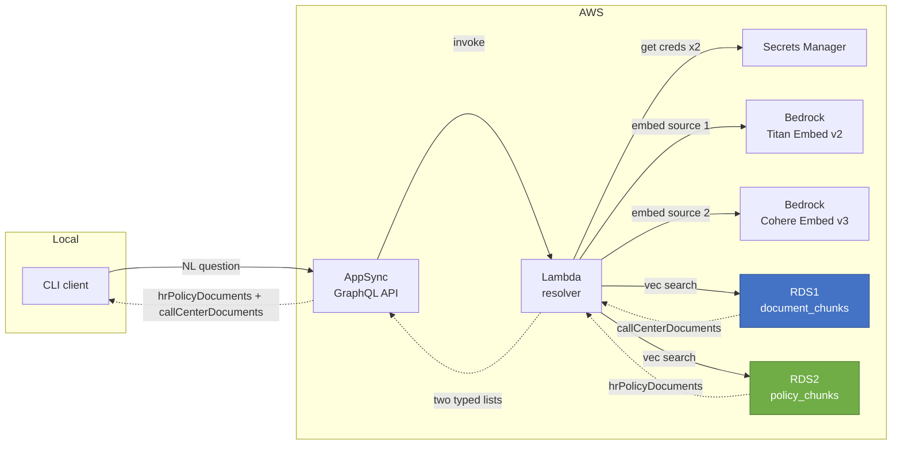
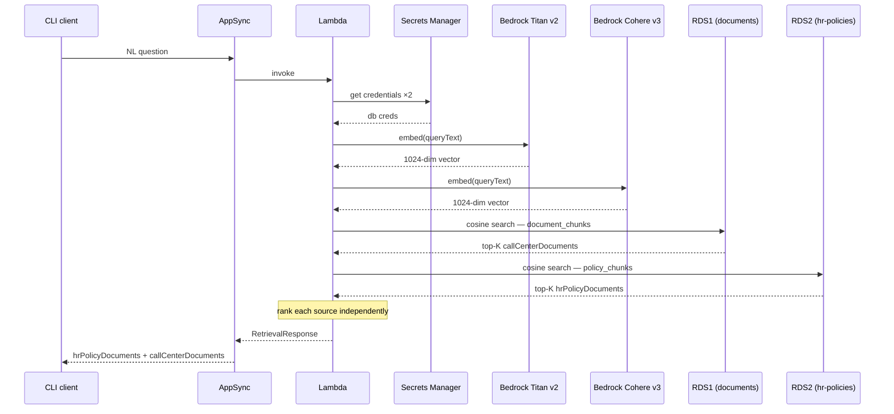

# Demo: AppSync Semantic Retrieval POC

This is a running POC for semantic search over GraphQL on AWS.
A client sends a plain-English question and gets back ranked text passages from two independent knowledge bases — each source returned as its own typed list, making the origin of every result immediately visible. No vector math is exposed externally, no indication to the caller of how many backends were queried.

Both data sources are queried on every request. Source 1 (call-center documents) is embedded with Amazon Titan Embed v2; Source 2 (HR policies) is embedded with Cohere Embed English v3. Each source is ranked by cosine similarity within itself and returned under its own field in the response.

---

## Architecture



Per-request sequence:



Everything is Terraform-managed and destroyable with one command.

---

## Key Components

### GraphQL Schema

```graphql
type Query {
  retrieveMatchingDocuments(queryText: String!, topK: Int = 5, nextToken: String): RetrievalResponse!
}

type RetrievalResponse {
  queryText: String!
  hrPolicyDocuments: [HRPolicyDocument!]!
  callCenterDocuments: [CallCenterDocument!]!
  totalResults: Int
  hasMore: Boolean
  nextToken: String
}

type HRPolicyDocument {
  documentId: String!
  chunkId: String!
  text: String!
  similarityScore: Float!
  source: String
  metadata: DocumentMetadata
}

type CallCenterDocument {
  documentId: String!
  chunkId: String!
  text: String!
  similarityScore: Float!
  source: String
  metadata: DocumentMetadata
}

type DocumentMetadata {
  title: String
  category: String
  createdAt: String
  updatedAt: String
}
```

### Database Schemas

**Source 1 — call-center documents** (`embeddingdb` on RDS1):

```sql
CREATE TABLE document_chunks (
    chunk_id      TEXT PRIMARY KEY,
    document_id   TEXT NOT NULL,
    text          TEXT NOT NULL,
    source        TEXT,
    embedding     vector(1024)    -- Bedrock Titan Embed v2
);
```

**Source 2 — HR policies** (`hrpolicydb` on RDS2):

```sql
CREATE TABLE policy_chunks (
    chunk_id    TEXT PRIMARY KEY,
    policy_id   TEXT NOT NULL,     -- domain name instead of document_id
    text        TEXT NOT NULL,
    category    TEXT,              -- "onboarding" | "leave" | "performance"
    source      TEXT,
    embedding   vector(1024)       -- Bedrock Cohere Embed English v3
);
```

The two schemas are intentionally slightly different. The `policy_chunks` table uses `policy_id` instead of `document_id` and carries an extra `category` column for HR-specific classification. `category` is now surfaced through the API via `HRPolicyDocument.metadata.category`.

### Two Typed Result Lists

Every request fans out to both sources and always returns both `hrPolicyDocuments` and `callCenterDocuments`. Each list is ranked independently by cosine similarity within its own source — there is no cross-source merging or re-ranking. This means:

- A clearly HR-focused query will have high scores in `hrPolicyDocuments` and low scores in `callCenterDocuments`
- A clearly call-center query will have the opposite pattern
- The caller can see both lists and understand the relevance contrast without needing a `dataSource` tag on individual items

---

## What's in the Databases

**Source 1 — 8 chunks across 3 call-center documents** (embedded with Titan Embed v2):

```
doc-001: "Call center process overview"
  chunk-001  Agents should verify customer identity before discussing loan details.
  chunk-002  Escalate servicing exceptions to the specialist queue.

doc-002: "Call center quality and compliance"
  chunk-003  All customer calls must be recorded for quality assurance and regulatory compliance.
  chunk-004  Agents are required to read the disclosure script at the start of each servicing call.
  chunk-005  Payment arrangements must be documented in the system within 24 hours of the customer agreement.

doc-003: "Customer interaction guidelines"
  chunk-006  Agents should use the customer's name at least twice during the call to build rapport.
  chunk-007  Never place a customer on hold for more than three minutes without providing a status update.
  chunk-008  If a customer requests a supervisor, transfer the call within two minutes and document the reason.
```

**Source 2 — 8 chunks across 3 HR policy documents** (embedded with Cohere Embed English v3):

```
pol-001: "Employee Onboarding Policy"  [category: onboarding]
  pol-001-c1  All new hires must complete mandatory compliance training within the first 30 days of employment.
  pol-001-c2  New employees are assigned a buddy from their team for the first 90 days to support integration.

pol-002: "Time Off and Leave Policy"  [category: leave]
  pol-002-c1  Employees accrue 1.5 days of paid time off per month, up to a maximum of 18 days per calendar year.
  pol-002-c2  Requests for leave exceeding five consecutive days must be submitted at least two weeks in advance.
  pol-002-c3  Parental leave of up to 12 weeks is available for primary caregivers following the birth or adoption of a child.

pol-003: "Performance Review Policy"  [category: performance]
  pol-003-c1  Annual performance reviews are conducted in December and directly inform compensation adjustments effective January.
  pol-003-c2  Employees receiving a below-expectations rating must complete a 60-day performance improvement plan.
  pol-003-c3  Mid-year check-ins are mandatory for all employees and should be scheduled between June and July.
```

Each chunk is stored alongside its 1024-dimensional embedding vector, generated once at seed time.

---

## Prerequisites

- An AWS profile configured with access to the target account
- Bedrock model access enabled in `us-east-1` for both:
  - `amazon.titan-embed-text-v2:0`
  - `cohere.embed-english-v3`
  (AWS Console → Bedrock → Model access → Request access)
- Terraform >= 1.6 and Python 3 installed locally

Set your profile before running any commands:

```bash
export AWS_PROFILE=<your-profile>
export AWS_REGION=us-east-1
```

---

## How to Run It

### 1. Install dependencies and build Lambda layer

```bash
make bootstrap
```

### 2. Provision infrastructure

```bash
make tf-init
make tf-plan   # preview — should show 32 resources to add
make tf-apply  # takes ~7 minutes; provisions 2 RDS instances, Lambda, AppSync, VPC
```

This provisions 32 resources. The two RDS instances are the slow part (~5 minutes each, provisioned in parallel).

### 3. Seed both databases

```bash
make seed
```

Output:
```
Using AWS_PROFILE=<your-profile> AWS_REGION=us-east-1

[Source 1] Connected to documents RDS. Setting up schema...
  Embedding chunk-001 (Titan v2)...
  ...
  Embedding chunk-008 (Titan v2)...
[Source 1] Done. Inserted/updated 8 chunks.

[Source 2] Connected to HR policy RDS. Setting up schema...
  Embedding pol-001-c1 (Cohere English v3)...
  ...
  Embedding pol-003-c3 (Cohere English v3)...
[Source 2] Done. Inserted/updated 8 chunks.

Total: 16 chunks across both sources.
```

### 4. Run queries

```bash
make query q="your question here"
```

---

## Running Results

### HR-domain query

A question clearly about HR shows high scores in `hrPolicyDocuments` and very low scores in `callCenterDocuments`:

```
$ make query q="What is the leave policy?"

Query: What is the leave policy?
Total results: 10

HR Policy Documents (5):
  [1] score=0.4116  source=hr-policy-leave  category=leave
      Parental leave of up to 12 weeks is available for primary caregivers following the birth or adoption of a child.

  [2] score=0.3624  source=hr-policy-leave  category=leave
      Requests for leave exceeding five consecutive days must be submitted at least two weeks in advance.

  [3] score=0.3227  source=hr-policy-leave  category=leave
      Employees accrue 1.5 days of paid time off per month, up to a maximum of 18 days per calendar year.

  [4] score=0.2243  source=hr-policy-onboarding  category=onboarding
      All new hires must complete mandatory compliance training within the first 30 days of employment.

  [5] score=0.2070  source=hr-policy-performance  category=performance
      Employees receiving a below-expectations rating must complete a 60-day performance improvement plan.


Call Center Documents (5):
  [1] score=0.0942  source=sample-doc-1
      Agents should verify customer identity before discussing loan details.

  [2] score=0.0871  source=sample-doc-3
      If a customer requests a supervisor, transfer the call within two minutes and document the reason.

  [3] score=0.0859  source=sample-doc-2
      Payment arrangements must be documented in the system within 24 hours of the customer agreement.

  [4] score=0.0685  source=sample-doc-3
      Never place a customer on hold for more than three minutes without providing a status update.

  [5] score=0.0580  source=sample-doc-2
      Agents are required to read the disclosure script at the start of each servicing call.
```

The HR policy scores (0.41–0.21) are roughly 4× higher than the call-center scores (0.09–0.06). The three leave-specific chunks rank 1–3 with the `category=leave` label making them immediately identifiable. The call-center source is present but clearly irrelevant.

---

### Call-center-domain query

A call-center question inverts the pattern — high scores in `callCenterDocuments`, low scores in `hrPolicyDocuments`:

```
$ make query q="How should agents handle customer identity?"

Query: How should agents handle customer identity?
Total results: 10

HR Policy Documents (5):
  [1] score=0.2160  source=hr-policy-onboarding  category=onboarding
      New employees are assigned a buddy from their team for the first 90 days to support integration.

  [2] score=0.1660  source=hr-policy-performance  category=performance
      Employees receiving a below-expectations rating must complete a 60-day performance improvement plan.

  [3] score=0.1369  source=hr-policy-onboarding  category=onboarding
      All new hires must complete mandatory compliance training within the first 30 days of employment.

  [4] score=0.1200  source=hr-policy-performance  category=performance
      Mid-year check-ins are mandatory for all employees and should be scheduled between June and July.

  [5] score=0.1012  source=hr-policy-performance  category=performance
      Annual performance reviews are conducted in December and directly inform compensation adjustments effective January.


Call Center Documents (5):
  [1] score=0.5873  source=sample-doc-1
      Agents should verify customer identity before discussing loan details.

  [2] score=0.4286  source=sample-doc-3
      Agents should use the customer's name at least twice during the call to build rapport.

  [3] score=0.2907  source=sample-doc-2
      Agents are required to read the disclosure script at the start of each servicing call.

  [4] score=0.2507  source=sample-doc-2
      All customer calls must be recorded for quality assurance and regulatory compliance.

  [5] score=0.1703  source=sample-doc-3
      Never place a customer on hold for more than three minutes without providing a status update.
```

The call-center scores (0.59–0.17) are far above the HR scores (0.22–0.10). The top call-center result (0.59) is a direct hit. The HR list is present and populated — useful for confirming there is no surprising cross-source relevance.

---

### Targeted call-center query

A more specific call-center query shows the relevance shift within the call-center source:

```
$ make query q="What do I do with a servicing exception?"

Query: What do I do with a servicing exception?
Total results: 10

HR Policy Documents (5):
  [1] score=0.1611  source=hr-policy-performance  category=performance
      Employees receiving a below-expectations rating must complete a 60-day performance improvement plan.

  [2] score=0.1389  source=hr-policy-leave  category=leave
      Employees accrue 1.5 days of paid time off per month, up to a maximum of 18 days per calendar year.

  [3] score=0.1145  source=hr-policy-leave  category=leave
      Requests for leave exceeding five consecutive days must be submitted at least two weeks in advance.

  [4] score=0.1108  source=hr-policy-leave  category=leave
      Parental leave of up to 12 weeks is available for primary caregivers following the birth or adoption of a child.

  [5] score=0.0914  source=hr-policy-onboarding  category=onboarding
      All new hires must complete mandatory compliance training within the first 30 days of employment.


Call Center Documents (5):
  [1] score=0.4776  source=sample-doc-1
      Escalate servicing exceptions to the specialist queue.

  [2] score=0.1893  source=sample-doc-3
      If a customer requests a supervisor, transfer the call within two minutes and document the reason.

  [3] score=0.1192  source=sample-doc-3
      Never place a customer on hold for more than three minutes without providing a status update.

  [4] score=0.1175  source=sample-doc-2
      Agents are required to read the disclosure script at the start of each servicing call.

  [5] score=0.0963  source=sample-doc-2
      Payment arrangements must be documented in the system within 24 hours of the customer agreement.
```

The escalation chunk moves to rank 1 in `callCenterDocuments` at 0.48 — a clear semantic hit. The HR list scores are all below 0.17, confirming the query has no meaningful HR relevance. The side-by-side presentation makes this contrast immediately readable without any post-processing.

---

## Tear Down

```bash
make tf-destroy
```

Destroys all 32 AWS resources, including both RDS instances. No snapshots are kept (`skip_final_snapshot = true` on both).

---

## Repo

`https://github.com/pwang-hydrafacial/fm-appsync-embedding-retrieval-poc`
