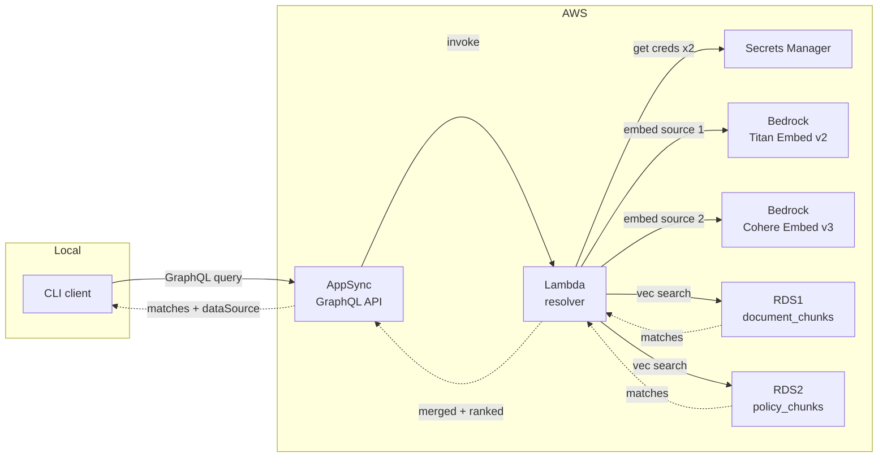
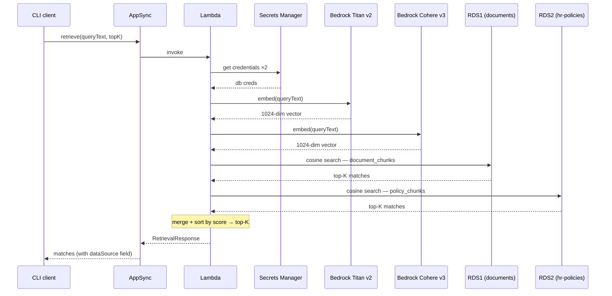

# Demo: AppSync Semantic Retrieval POC

This is a running POC for semantic search over GraphQL on AWS.
A client sends a plain-English question and gets back ranked text passages from two independent knowledge bases — no vector math exposed externally, no indication to the caller of how many backends were queried.

Phase 2 adds a second data source (HR policies, embedded with Cohere Embed English v3) alongside the original call-center document store (embedded with Amazon Titan Embed v2). Both sources are queried on every request, and results are merged and re-ranked by cosine similarity before the response is returned.

---

## Architecture



Per-request sequence:



ASCII fallback:

```
┌─────────────┐
│  CLI client │  (local)
└──────┬──▲───┘
       │  │ matches + dataSource
  query│  │
       ▼  │
┌─────────────────────────────────────────────────────────────────────────┐
│  AWS                                                                     │
│                                                                          │
│  AppSync ──invoke──▶ Lambda ┬── embed ──▶ Bedrock Titan Embed v2        │
│  GraphQL ←─response─        ├── embed ──▶ Bedrock Cohere Embed v3       │
│  API                        ├── creds ──▶ Secrets Manager               │
│                             ├── search ─▶ RDS1 (document_chunks)        │
│                             └── search ─▶ RDS2 (policy_chunks)          │
│                               [merge + re-rank top-K]                   │
└──────────────────────────────────────────────────────────────────────────┘
```

Everything is Terraform-managed and destroyable with one command.

---

## Key Components

### GraphQL Schema

The external contract is unchanged from Phase 1 except for the new nullable `dataSource` field — existing clients continue to work.

```graphql
type Query {
  retrieve(queryText: String!, topK: Int = 5): RetrievalResponse!
}

type RetrievalResponse {
  queryText: String!
  matches: [RetrievalMatch!]!
}

type RetrievalMatch {
  documentId:      String!
  chunkId:         String!
  text:            String!
  similarityScore: Float!
  source:          String
  dataSource:      String    # "documents" or "hr-policies"
}
```

### Database Schemas

**Source 1 — call-center documents** (`embeddingdb` on RDS1):

```sql
CREATE TABLE document_chunks (
    chunk_id      TEXT PRIMARY KEY,
    document_id   TEXT NOT NULL,
    text          TEXT NOT NULL,
    source        TEXT,
    embedding     vector(1024)    -- Bedrock Titan Embed v2
);
```

**Source 2 — HR policies** (`hrpolicydb` on RDS2):

```sql
CREATE TABLE policy_chunks (
    chunk_id    TEXT PRIMARY KEY,
    policy_id   TEXT NOT NULL,     -- domain name instead of document_id
    text        TEXT NOT NULL,
    category    TEXT,              -- "onboarding" | "leave" | "performance"
    source      TEXT,
    embedding   vector(1024)       -- Bedrock Cohere Embed English v3
);
```

The two schemas are intentionally slightly different. The `policy_chunks` table uses `policy_id` instead of `document_id` and carries an extra `category` column for HR-specific classification. The Lambda normalizes both into the common `RetrievalMatch` response type; `category` is stored in the DB but not exposed externally.

### The Merge Step

After collecting up to `topK` candidates from each source, the Lambda sorts the combined pool by `similarityScore` descending and returns the overall top-K:

```python
merged = search_source1(emb1, top_k) + search_source2(emb2, top_k)
merged.sort(key=lambda x: x["similarityScore"], reverse=True)
return merged[:top_k]
```

Both models produce unit-normalized 1024-dimensional vectors, so cosine similarity scores sit in the `[0, 1]` range for both. The scores are not calibrated across models — a `0.4` from Titan and a `0.4` from Cohere are not exactly equivalent — but the approximation is sound enough for ranking at POC scale.

---

## What's in the Databases

**Source 1 — 8 chunks across 3 call-center documents** (embedded with Titan Embed v2):

```
doc-001: "Call center process overview"
  chunk-001  Agents should verify customer identity before discussing loan details.
  chunk-002  Escalate servicing exceptions to the specialist queue.

doc-002: "Call center quality and compliance"
  chunk-003  All customer calls must be recorded for quality assurance and regulatory compliance.
  chunk-004  Agents are required to read the disclosure script at the start of each servicing call.
  chunk-005  Payment arrangements must be documented in the system within 24 hours of the customer agreement.

doc-003: "Customer interaction guidelines"
  chunk-006  Agents should use the customer's name at least twice during the call to build rapport.
  chunk-007  Never place a customer on hold for more than three minutes without providing a status update.
  chunk-008  If a customer requests a supervisor, transfer the call within two minutes and document the reason.
```

**Source 2 — 8 chunks across 3 HR policy documents** (embedded with Cohere Embed English v3):

```
pol-001: "Employee Onboarding Policy"  [category: onboarding]
  pol-001-c1  All new hires must complete mandatory compliance training within the first 30 days of employment.
  pol-001-c2  New employees are assigned a buddy from their team for the first 90 days to support integration.

pol-002: "Time Off and Leave Policy"  [category: leave]
  pol-002-c1  Employees accrue 1.5 days of paid time off per month, up to a maximum of 18 days per calendar year.
  pol-002-c2  Requests for leave exceeding five consecutive days must be submitted at least two weeks in advance.
  pol-002-c3  Parental leave of up to 12 weeks is available for primary caregivers following the birth or adoption of a child.

pol-003: "Performance Review Policy"  [category: performance]
  pol-003-c1  Annual performance reviews are conducted in December and directly inform compensation adjustments effective January.
  pol-003-c2  Employees receiving a below-expectations rating must complete a 60-day performance improvement plan.
  pol-003-c3  Mid-year check-ins are mandatory for all employees and should be scheduled between June and July.
```

Each chunk is stored alongside its 1024-dimensional embedding vector, generated once at seed time.

---

## Prerequisites

- An AWS profile configured with access to the target account
- Bedrock model access enabled in `us-east-1` for both:
  - `amazon.titan-embed-text-v2:0`
  - `cohere.embed-english-v3`
  (AWS Console → Bedrock → Model access → Request access)
- Terraform >= 1.6 and Python 3 installed locally

Set your profile before running any commands:

```bash
export AWS_PROFILE=<your-profile>
export AWS_REGION=us-east-1
```

---

## How to Run It

### 1. Install dependencies and build Lambda layer

```bash
make bootstrap
```

### 2. Provision infrastructure

```bash
make tf-init
make tf-plan   # preview — should show 32 resources to add
make tf-apply  # takes ~7 minutes; provisions 2 RDS instances, Lambda, AppSync, VPC
```

This provisions 32 resources. The two RDS instances are the slow part (~5 minutes each, provisioned in parallel).

### 3. Seed both databases

```bash
make seed
```

Output:
```
Using AWS_PROFILE=<your-profile> AWS_REGION=us-east-1

[Source 1] Connected to documents RDS. Setting up schema...
  Embedding chunk-001 (Titan v2)...
  Embedding chunk-002 (Titan v2)...
  ...
  Embedding chunk-008 (Titan v2)...
[Source 1] Done. Inserted/updated 8 chunks.

[Source 2] Connected to HR policy RDS. Setting up schema...
  Embedding pol-001-c1 (Cohere English v3)...
  Embedding pol-001-c2 (Cohere English v3)...
  ...
  Embedding pol-003-c3 (Cohere English v3)...
[Source 2] Done. Inserted/updated 8 chunks.

Total: 16 chunks across both sources.
```

### 4. Run queries

```bash
make query q="your question here"
```

---

## Running Results

### Domain-specific routing: HR query

A question clearly about HR returns results entirely from the HR policy source:

```
$ make query q="What is the leave policy?"

Query: What is the leave policy?
Matches (5):

  [1] score=0.4116  source=hr-policy-leave  dataSource=hr-policies
      Parental leave of up to 12 weeks is available for primary caregivers following the birth or adoption of a child.

  [2] score=0.3624  source=hr-policy-leave  dataSource=hr-policies
      Requests for leave exceeding five consecutive days must be submitted at least two weeks in advance.

  [3] score=0.3227  source=hr-policy-leave  dataSource=hr-policies
      Employees accrue 1.5 days of paid time off per month, up to a maximum of 18 days per calendar year.

  [4] score=0.2243  source=hr-policy-onboarding  dataSource=hr-policies
      All new hires must complete mandatory compliance training within the first 30 days of employment.

  [5] score=0.2070  source=hr-policy-performance  dataSource=hr-policies
      Employees receiving a below-expectations rating must complete a 60-day performance improvement plan.
```

All five results come from the HR policy database. The three leave-specific chunks rank 1–3, with related HR content filling out the tail. The call-center source contributes nothing to this query — its cosine similarity scores against a leave-policy question are low enough to fall outside the top 5.

---

### Domain-specific routing: call-center query

A call-center question draws almost entirely from the documents source, with a faint cross-source bleed at rank 5:

```
$ make query q="How should agents handle customer identity?"

Query: How should agents handle customer identity?
Matches (5):

  [1] score=0.5873  source=sample-doc-1  dataSource=documents
      Agents should verify customer identity before discussing loan details.

  [2] score=0.4286  source=sample-doc-3  dataSource=documents
      Agents should use the customer's name at least twice during the call to build rapport.

  [3] score=0.2907  source=sample-doc-2  dataSource=documents
      Agents are required to read the disclosure script at the start of each servicing call.

  [4] score=0.2507  source=sample-doc-2  dataSource=documents
      All customer calls must be recorded for quality assurance and regulatory compliance.

  [5] score=0.2160  source=hr-policy-onboarding  dataSource=hr-policies
      New employees are assigned a buddy from their team for the first 90 days to support integration.
```

Ranks 1–4 come from the call-center source. Rank 5 is an HR policy chunk about onboarding — it scored just above the remaining call-center chunks because "customer identity" and "employee integration" share some semantic neighborhood in Cohere's embedding space. The `dataSource` label makes this cross-source result immediately visible.

What this demonstrates: the merge + re-rank approach naturally routes queries to their most relevant source. The caller does not need to know which source to query — relevance drives the ranking automatically.

---

### The ranking flip

A more targeted call-center query shows the ranking shift as expected:

```
$ make query q="What do I do with a servicing exception?"

Query: What do I do with a servicing exception?
Matches (5):

  [1] score=0.4776  source=sample-doc-1  dataSource=documents
      Escalate servicing exceptions to the specialist queue.

  [2] score=0.1893  source=sample-doc-3  dataSource=documents
      If a customer requests a supervisor, transfer the call within two minutes and document the reason.

  [3] score=0.1611  source=hr-policy-performance  dataSource=hr-policies
      Employees receiving a below-expectations rating must complete a 60-day performance improvement plan.

  [4] score=0.1389  source=hr-policy-leave  dataSource=hr-policies
      Employees accrue 1.5 days of paid time off per month, up to a maximum of 18 days per calendar year.

  [5] score=0.1192  source=sample-doc-3  dataSource=documents
      Never place a customer on hold for more than three minutes without providing a status update.
```

The escalation chunk moves to rank 1 (from rank 2 in the identity query), confirming the semantic routing is working correctly. Note that ranks 3–4 are HR policy chunks — the word "exception" has semantic overlap with performance and leave policy language, causing low-scoring cross-source bleed. The `dataSource` label makes these easily identifiable.

---

## Tear Down

```bash
make tf-destroy
```

Destroys all 32 AWS resources, including both RDS instances. No snapshots are kept (`skip_final_snapshot = true` on both).

---

## Repo

`https://github.com/pwang-hydrafacial/fm-appsync-embedding-retrieval-poc`
